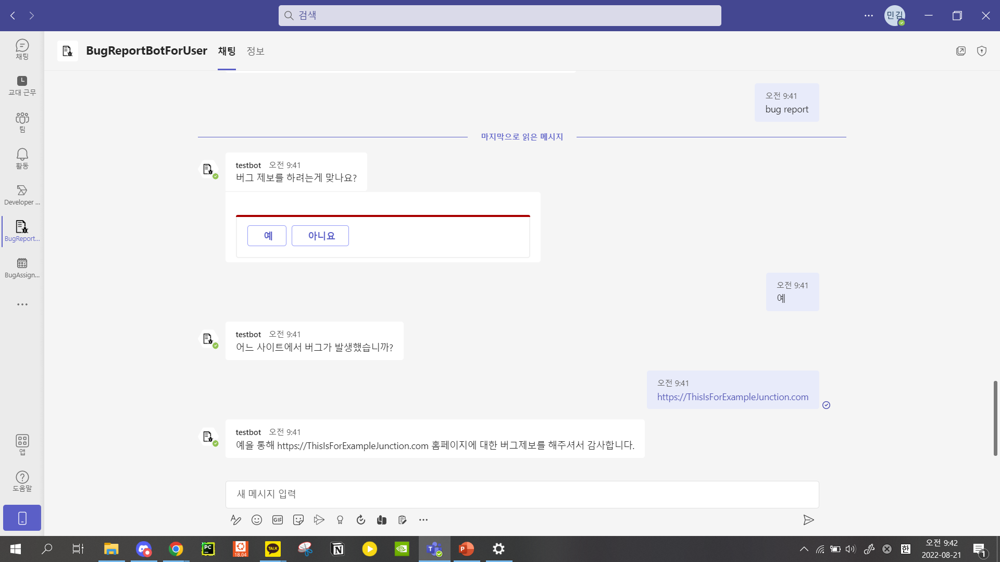
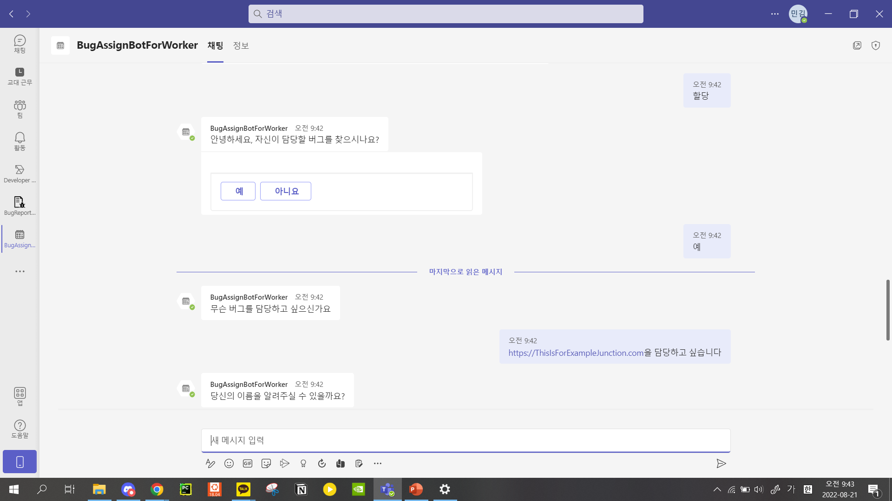
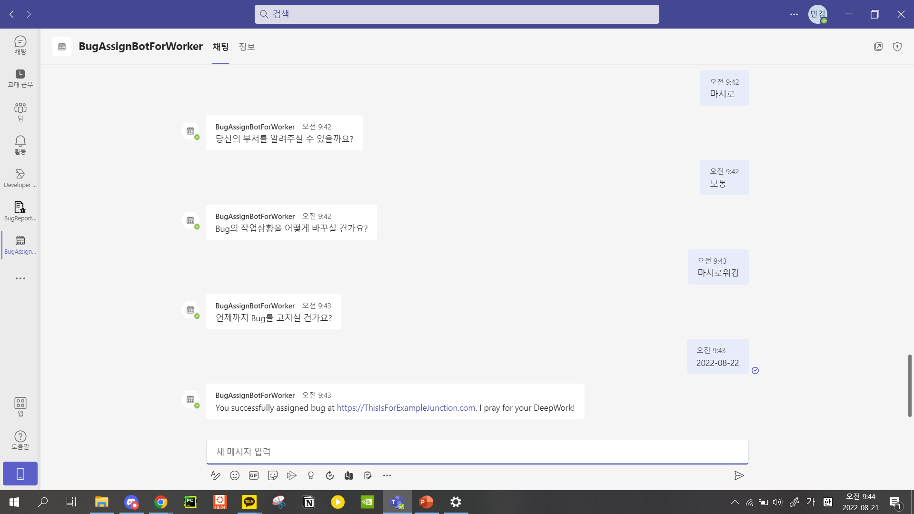
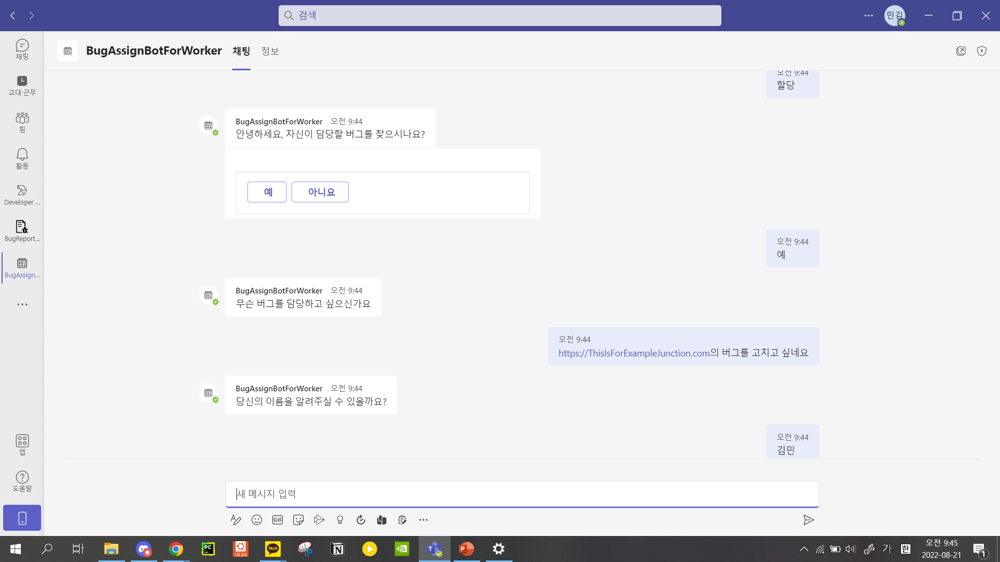
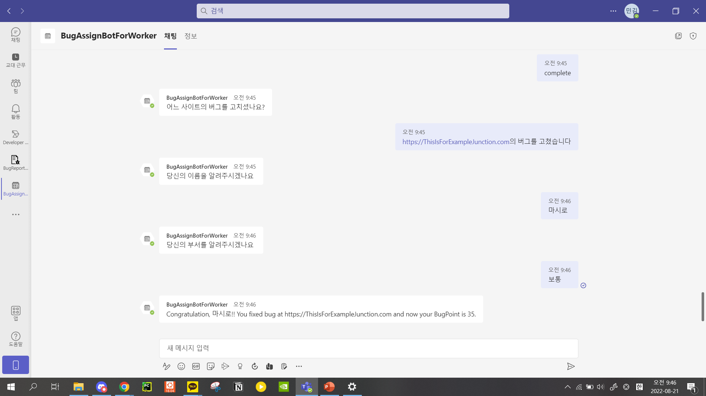

# DeepWork.MS_Junction2022
## How to setup BugReportBotForUser

## How to Report bug

### example

## How to setup BugAssignBotForWorker

## How to Assign bug

### example
#### Assign Success

#### Assign Failure

## How to Report you fixed assigned bug (and update leader board)

### example

